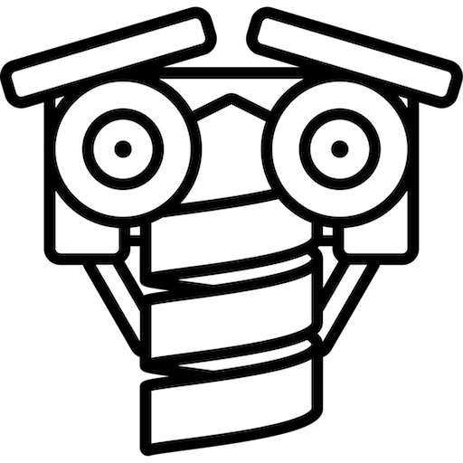

# JohnnyFive.js

[](https://travis-ci.org/ZEISS/JohnnyFiveScalaJS)

This is a Scala adapter to [Johnny-Five](http://johnny-five.io).

Example usage:

```scala
import johnnyfivescalajs.JohnnyFive._

val board  = Board(new BoardOption {override val repl = false })
val button = Button(12) // Param is pin number
button.on("hold", () =>  board.digitalWrite(1,1))
```

## Getting Started

Add the following to your sbt build definition:

libraryDependencies += "com.zeiss" %%% "johnny5scala-js" % "0.0.1"

then

```scala
import  johnnyfivescalajs.JohnnyFive._

// now you can use the objects eg.

val board  = Board()
```

### Javascript Dependencies

JohnnyFive.js doesn't actually come bundled with the underlying `johnnyfive.js` file, so you'll need to add them manually.

## Documentation

JohnnyFive.io:

- The API documentation can be found [here](http://johnny-five.io/api/).

## Bugs and Feedback

For bugs, questions and discussions please use the Github Issues.

## LICENSE

Licensed under the Apache License, Version 2.0 (the "License");
you may not use this file except in compliance with the License.
You may obtain a copy of the License at

<https://www.apache.org/licenses/LICENSE-2.0>

Unless required by applicable law or agreed to in writing, software
distributed under the License is distributed on an "AS IS" BASIS,
WITHOUT WARRANTIES OR CONDITIONS OF ANY KIND, either express or implied.
See the License for the specific language governing permissions and
limitations under the License.
